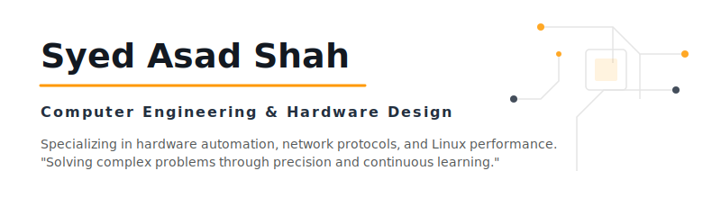
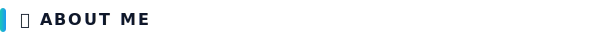
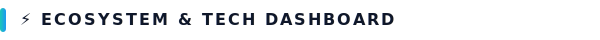
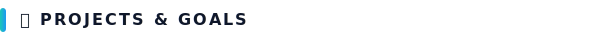

  

  

Welcome to my official GitHub workspace. I am **Syed Asad Abbas Shah**, I am a Computer Engineering Technology student specializing in hardware co-design, Linux systems automation, and network architectures.

### 🐧 Workstation & OS Environment
I build and compile my projects on **CachyOS Linux**—a performance-optimized distribution built on top of Arch Linux, paired with the highly customizable **KDE Plasma** desktop environment (featuring unified design themes across terminal environments and the Dolphin file manager).

🚀 **KDE Plasma 6.7 & Engineering**: I am actively tracking the upcoming release of **KDE Plasma 6.7** launching on **June 16, 2026** (streaming on CachyOS Linux). For Computer Engineering Technology, Plasma 6.7 offers a highly optimized development canvas, featuring seamless window tiling, advanced terminal integration, and low-latency system-level rendering. This setup provides a robust environment for compiling high-performance C++ binaries, scripting automation in Python, and routing multi-layer PCBs in KiCad.

---

  

<table align="center" width="100%">
  <thead>
    <tr>
      <th align="center" width="33%">🐧 Operating Systems &amp; DE</th>
      <th align="center" width="33%">🛠️ Hardware &amp; Languages</th>
      <th align="center" width="33%">🔧 Engineering Software</th>
    </tr>
  </thead>
  <tbody>
    <tr>
      <td align="center" valign="middle">
        &nbsp;&nbsp;
        &nbsp;&nbsp;
        
         
        <b>CachyOS / Arch / KDE</b>
      </td>
      <td align="center" valign="middle">
        &nbsp;&nbsp;
        &nbsp;&nbsp;
        
         
        <b>KiCad / C++ &amp; Python (20%)</b>
      </td>
      <td align="center" valign="middle">
        &nbsp;&nbsp;
        &nbsp;&nbsp;
        &nbsp;&nbsp;
        
         
        <b>Desktop / CLI / Git / GIMP</b>
      </td>
    </tr>
  </tbody>
</table>

---

  

*   **ATX Power Supply V2**: A custom-designed desktop laboratory power supply utilizing KiCad for schematic capture and multi-layer PCB layout.
*   **[kitchen-lexicon-android](https://github.com/Syed-Asad-Abbas-Shah/kitchen-lexicon-android)**: A premium, native Android application featuring an interactive glossary of kitchen utensils, vector icons, custom sound synthesis, and Text-To-Speech.
*   **Professional Objective**: Aspiring to become an **Embedded Systems Engineer** or **Computer Hardware Engineer**, specializing in hardware-software co-design, Linux performance tuning, and network security.

---

  

  <picture>
    <source media="(prefers-color-scheme: dark)" srcset="https://github-readme-stats.vercel.app/api?username=Syed-Asad-Abbas-Shah&show_icons=true&theme=dark&bg_color=0d1117&title_color=FF9900&text_color=c9d1d9&icon_color=FF9900&border_color=30363d" />
    <source media="(prefers-color-scheme: light)" srcset="https://github-readme-stats.vercel.app/api?username=Syed-Asad-Abbas-Shah&show_icons=true&theme=default&bg_color=ffffff&title_color=131921&text_color=232F3E&icon_color=FF9900&border_color=e0e0e0" />
    
  </picture>
  <picture>
    <source media="(prefers-color-scheme: dark)" srcset="https://github-readme-stats.vercel.app/api/top-langs/?username=Syed-Asad-Abbas-Shah&layout=compact&theme=dark&bg_color=0d1117&title_color=FF9900&text_color=c9d1d9&icon_color=FF9900&border_color=30363d" />
    <source media="(prefers-color-scheme: light)" srcset="https://github-readme-stats.vercel.app/api/top-langs/?username=Syed-Asad-Abbas-Shah&layout=compact&theme=default&bg_color=ffffff&title_color=131921&text_color=232F3E&icon_color=FF9900&border_color=e0e0e0" />
    
  </picture>

---

<!-- 
SEO metadata block to ensure indexing under search terms:
Syed Asad Abbas Shah, Syed Asad, Asad, Syed-Asad-Abbas-Shah, Syed Asad Shah, SyedAsadAbbasShah, CachyOS, KDE Plasma 6.7
-->

  Generated with precision. Engineered with <b>Google Antigravity</b>.

